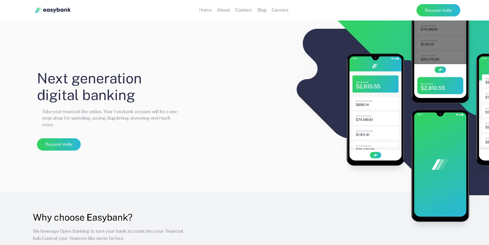

# EasyBank-Landing-Page

# Frontend Mentor - Easybank landing page solution

This is a solution to the [Easybank landing page challenge on Frontend Mentor](https://www.frontendmentor.io/challenges/easybank-landing-page-WaUhkoDN). Frontend Mentor challenges help you improve your coding skills by building realistic projects. 

## Table of contents

- [Overview](#overview)
  - [The challenge](#the-challenge)
  - [Screenshot](#screenshot)
  - [Links](#links)
- [My process](#my-process)
  - [Built with](#built-with)
  - [Continued development](#continued-development)
  - [Useful resources](#useful-resources)
- [Author](#author)

## Overview

### The challenge

Users should be able to:

- View the optimal layout for the site depending on their device's screen size
- See hover states for all interactive elements on the page

### Screenshot

### Links

- Live Site URL: [https://celebrated-flan-983e17.netlify.app](https://celebrated-flan-983e17.netlify.app)

## My process

### Built with

- Semantic HTML5 markup
- CSS custom properties
- Flexbox
- Mobile-first workflow
- Vanilla JS
- Tailwind CSS

### Continued development

After this project. I decided to focus more on the little components like responsive navbars and learn more about responsive design(I will learn bootstrap for grid system) and transition-transformation/animations and use SCSS. Currently I am trying to focus heavily JS and DSA. After couple of months later when i became comfortable with my JS and alghoritmic thinking, I will learn React. After that I will continue to focus more on bigger projects on frontend. 

### Useful resources

- [Example resource 1](https://www.example.com) - Tailwind CSS documentation.

## Author

- Frontend Mentor - [@Mustafacmn](https://www.frontendmentor.io/profile/Mustafacmn)
- Twitter - [@beginnercoder](https://twitter.com/beginnercoderr)
